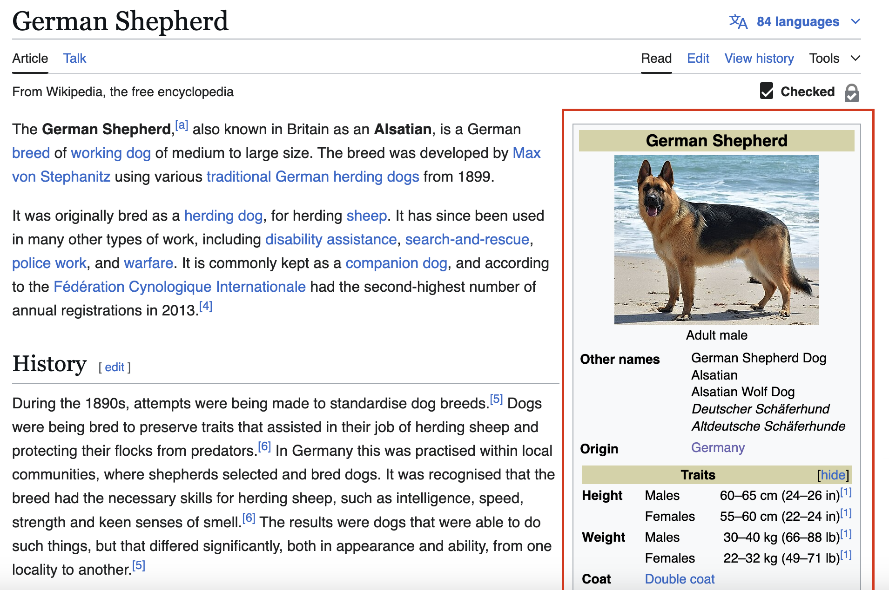
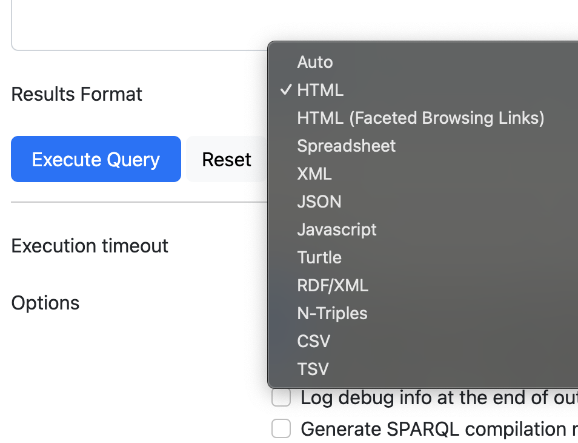

# Table of Contents

    
1. Introduction
2. Purpose of DBpedia
3. How DBpedia works
4. Challenges and Limitations

# Introduction

##  Purpose of DBpedia

  - Organizes Wikipedia's knowledge in a structured way that is accessible by everyone
  - Links people, places, events, and more in a way that other systems can understand and connect to.
  - Enables smarter searches and more complex and efficent querying for information

# History of DBpedia

- It was introduced in 2007 by people at Free University of Berlin and Leipzig University.
- Becomes a part of LOD Cloud in 2008 and is most interlinked part of it ever since.
- Wikidata was launched in 2012 and was integrated into DBpedia.
- In early versions, DBpedia faced delays in keeping the information up to date. However, now it is synced with Wikipedia in near realtime.

# Extraction

## Parsing Infoboxes

- DBpedia extracts data from infoboxes on Wikipedia pages, like "born in," "occupation," or "location," which are relatively standardized across similar types of articles.
- These help DBpedia identify key information that it can structure into a machine-readable format.

## DBpedia's Extraction Framework

- The DBpedia Extraction Framework is an open-source tool that scans Wikipedia’s infoboxes, links, and categories, then extracts the data to create triples (subject-predicate-object format). For example:
    - <Albert_Einstein> — <born_in> — <Ulm>
- This framework also extracts labels, abstracts (summaries), and links to other Wikipedia pages.
- Extracted information is converted into RDF format.
- A URI is assigned to each extracted resource which can be used to query and link it with other resources.

# Representation

- RDF (Resource Description Framework) is the core format that DBpedia uses but there are other forms of expression in which data can be retrieved:

# Challenges and Limitations

- Data Quality issues
    - Wikipedia data itself from which DBpedia is generated can be incorrect, outdated

- Can only caputre Inforamtion in the info boxes
- Linking with other databases to expand it's knowledge
- Huge database which makes querying less efficent